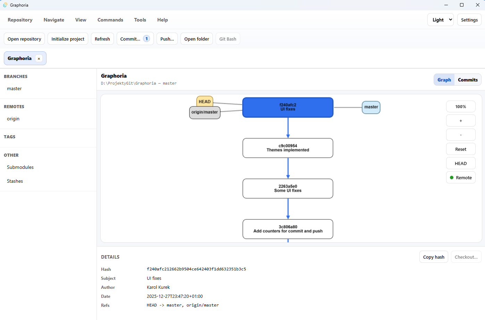

# Graphoria - The Git Client Powered with Graphs

A revolutionary Git client that transforms your repository history into an intuitive, interactive graph visualization. Unlike traditional Git clients that display commits in boring tables, Graphoria presents your entire Git history as a beautiful, navigable directed acyclic graph (DAG) that makes understanding complex relationships between commits effortless.

## 🚀 Why Graphoria?

Graphoria reimagines Git visualization by treating your repository history as what it truly is—a graph. Every branch, merge, and commit becomes a node in an interconnected web that you can explore, understand, and manipulate with unprecedented clarity. Say goodbye to confusing linear histories and hello to visual Git mastery.

## ✨ Key Features

### 📊 Revolutionary Graph Visualization
- **Interactive DAG Display**: Navigate your Git history as a beautiful, zoomable, pannable graph
- **Dual View Modes**: Switch between graph view and traditional commit table view
- **Flexible Layouts**: Choose between left-to-right or top-to-bottom graph orientations
- **Smart Graph Prediction**: Preview how operations will affect your repository structure before executing them

### 🛠️ Complete Git Operations
- **Repository Management**: Initialize, clone, and manage multiple repositories with tabbed interface
- **Core Git Commands**: Full support for commit, merge, rebase, checkout, push, fetch, and more
- **Advanced Operations**: Reset (soft/hard), reverse commits, force push with lease options
- **Remote Integration**: Seamless connectivity with GitHub, GitLab, Bitbucket, and other Git platforms

### 🎨 Modern & Customizable Interface
- **Multiple Themes**: Choose between light, dark, and blue color schemes
- **Fully Configurable**: Customize everything from button layouts to background colors
- **Rich Tooltips**: Hover over any operation to see detailed explanations and parameters
- **Professional UI**: Clean, modern interface designed for productivity

### 🔧 Developer-Friendly
- **Cross-Platform**: Works flawlessly on Windows, Linux, and macOS
- **Extensible Architecture**: Easy to extend with new features and integrations
- **Performance Optimized**: Built with Tauri and React for lightning-fast performance
- **Git Bash Integration**: Built-in terminal access for advanced Git operations

## 🎯 Project Goals

Graphoria was created to solve the fundamental problem of Git visualization complexity. Traditional Git clients force users to mentally reconstruct the relationships between commits, branches, and merges. Graphoria eliminates this cognitive load by presenting Git history exactly as it exists—as a graph.

Our mission is to make Git accessible to everyone while providing the power and flexibility that experienced developers demand. Whether you're a beginner learning Git or a seasoned developer managing complex repositories, Graphoria adapts to your workflow and enhances your productivity.

## 🏗️ Technical Excellence

Built with modern web technologies, Graphoria combines the best of both worlds:
- **Frontend**: React with TypeScript for type-safe, maintainable code
- **Backend**: Rust-powered Tauri for native performance and security
- **Graph Engine**: Advanced visualization libraries for smooth, interactive graph rendering
- **Configuration**: JSON-based settings for complete customization

## 🌟 What Makes Graphoria Special

- **Visual Git Understanding**: See your repository structure at a glance
- **Predictive Operations**: Preview changes before you make them
- **Multi-Repository Support**: Work with multiple repositories simultaneously
- **Professional Tools**: All the power of Git Extensions with modern UX
- **Cross-Platform Excellence**: Native performance on every major operating system

## 🚀 Getting Started

### Running locally (development)

1. Install Node.js (npm) and rust.
2. Clone/Download this repository.
3. Go to the project directory.
4. Install dependencies*:
   - `npm install`
5. Start the app in Tauri dev mode:
   - `npm run tauri dev`

\* If you are using Windows and PowerShell and see `npm File ... cannot be loaded because running scripts is disabled on this system...` error then run `Set-ExecutionPolicy RemoteSigned -Scope CurrentUser` and then run `npm install` again.

Experience the future of Git visualization today. Graphoria transforms how you interact with your code history, making complex Git operations intuitive and enjoyable.

Join thousands of developers who have already discovered that understanding Git doesn't have to be complicated—it just needs to be visual.

---

*Graphoria: Where Git history becomes art.*
